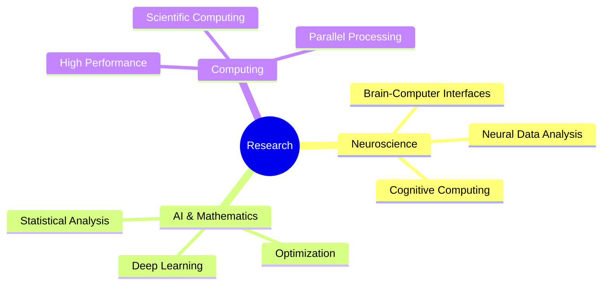
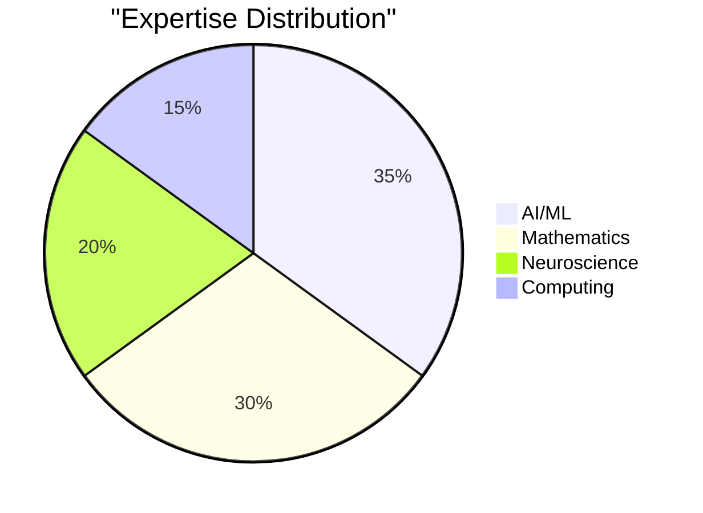
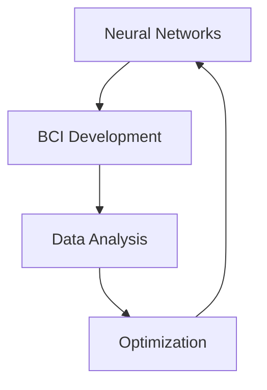
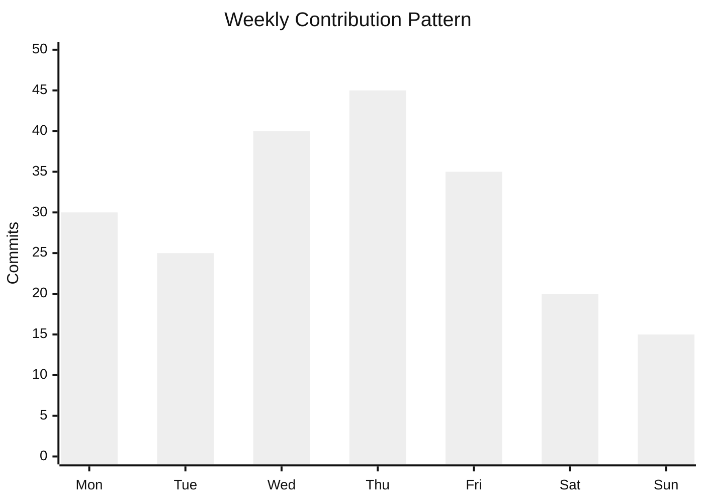
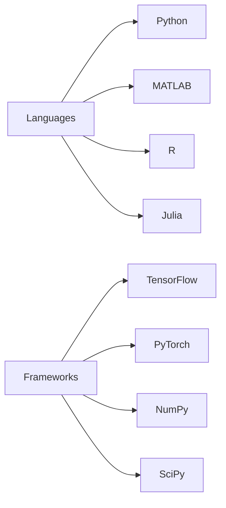
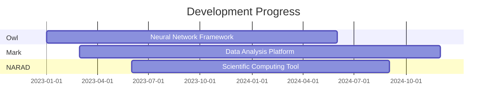
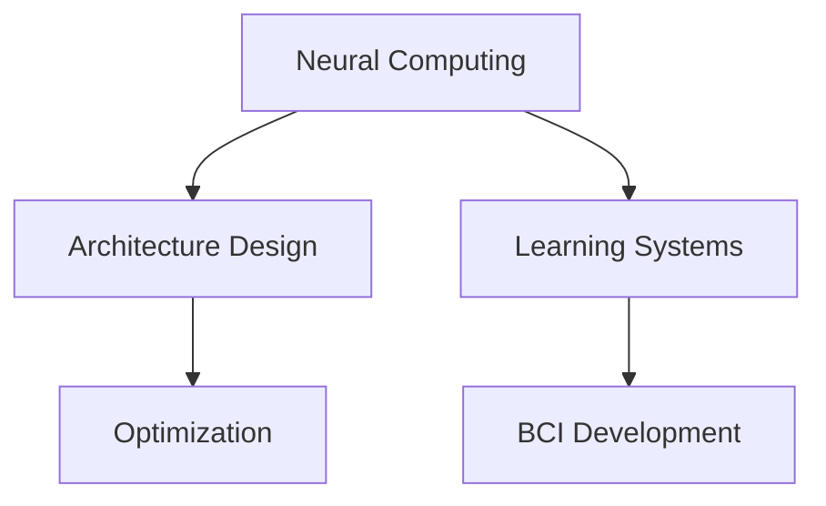
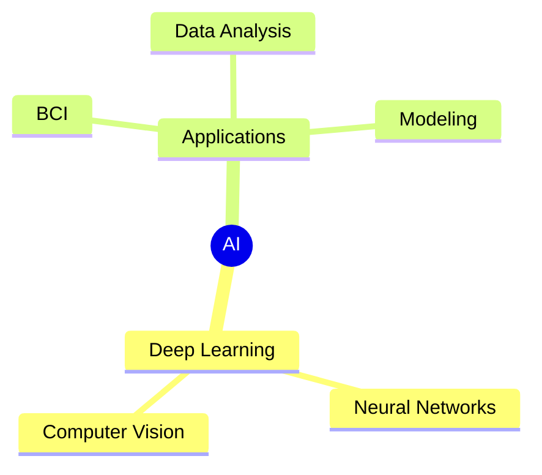
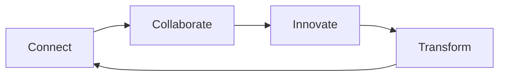

  

  

  
  
  

## 🎭 About Me

<table>
<tr>
<td width="60%">

### 🚀 Journey & Focus
As a Computational Mathematics student, I blend rigorous mathematical principles with cutting-edge AI technologies. My passion lies in developing innovative solutions that bridge the gap between theoretical mathematics and practical applications in artificial intelligence and neuroscience.

### 🎯 Research Interests

### 🌟 Key Highlights
- 🧬 Developing advanced neural architectures
- 🧠 Building brain-computer interfaces
- 📊 Creating mathematical models for AI
- 💻 Optimizing scientific computing tools

</td>
<td width="40%">

### 📈 Technical Focus

### 🎓 Education & Skills
- 📚 Computational Mathematics
- 🤖 Machine Learning
- 🧮 Algorithm Design
- 📊 Data Analysis

### 🔍 Current Projects

</td>
</tr>
</table>

## 📊 GitHub Analytics

  <table>
    <tr>
      <td width="50%">
        
      </td>
      <td width="50%">
        
      </td>
    </tr>
  </table>

### 📈 Contribution Overview

## 🛠️ Technology Stack

### Core Technologies

### Tools & Frameworks

### AI/ML Stack

### Development Tools

## 📚 Featured Projects

  <table>
    <tr>
      <td colspan="2">
        <h3>Project Timeline</h3>
        

      </td>
    </tr>
    <tr>
      <td width="50%">
        
      </td>
      <td width="50%">
        
      </td>
    </tr>
    <tr>
      <td colspan="2" align="center">
        
      </td>
    </tr>
  </table>

## 🔬 Research Areas

<table>
<tr>
<td width="50%">

### 🧠 Computational Neuroscience

</td>
<td width="50%">

### 🤖 AI Systems

</td>
</tr>
</table>

## 📊 Activity Metrics

  <table>
    <tr>
      <td width="33%">
        
      </td>
      <td width="33%">
        
      </td>
      <td width="33%">
        
      </td>
    </tr>
  </table>

## 🏆 Achievements

  

## 🤝 Let's Connect

  

    Passionate about pushing the boundaries of AI, Mathematics, and Neuroscience? 
    Let's create something amazing together!
  

  

  

  

