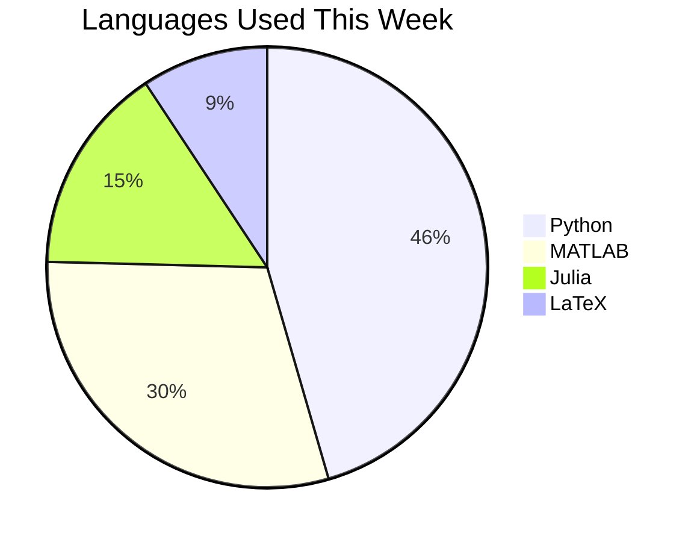
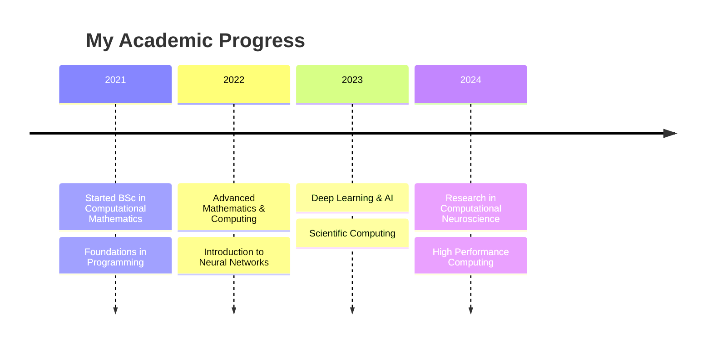

<div align="center">
  
</div>

<h1 align="center">
  
</h1>

<p align="center">
  <a href="https://twitter.com/sabinpokharel">
    
  </a>
  <a href="https://linkedin.com/in/sabinpokharel">
    
  </a>
  <a href="mailto:contact@sabinpokharel.com">
    
  </a>
  <a href="https://github.com/sabinpokharel">
    
  </a>
</p>

<div align="center">
  <h3>⚡ Quick Facts About Me</h3>
  
</div>

```javascript
const sabin = {
    pronouns: "he/him",
    education: {
        current: "BSc in Computational Mathematics",
        focus: ["AI/ML", "Scientific Computing", "Neuroscience"]
    },
    passions: [
        "Mathematical Modeling",
        "Neural Networks",
        "High Performance Computing",
        "Computational Neuroscience"
    ],
    programmingLanguages: ["Python", "MATLAB", "R", "Julia", "C++"],
    currentLearning: [
        "Deep Learning Architectures",
        "Parallel Computing",
        "Brain-Computer Interfaces"
    ],
    funFact: "I believe mathematics is the language of the universe 🌌"
};
```

## 🧠 Research Interests

<table align="center">
<tr>
<td align="center" width="50%">

</td>
<td align="center" width="50%">

### Key Areas of Focus

- 🔬 Computational Neuroscience
  - Neural Signal Processing
  - Brain Network Analysis
  
- 🤖 Artificial Intelligence
  - Deep Learning
  - Reinforcement Learning
  
- 📊 Scientific Computing
  - Numerical Methods
  - Parallel Algorithms

</td>
</tr>
</table>

## 📈 GitHub Statistics

<p align="center">
  
  
</p>

## 🛠️ Technology Stack

<div align="center">

### Languages


### AI/ML Frameworks


### Scientific Computing


### Tools & Technologies


</div>

## 📊 This Week's Coding Activity



## 🎯 Current Projects

<div align="center">
  <a href="https://github.com/sabinpokharel/neural-signal-processing">
    
  </a>
  <a href="https://github.com/sabinpokharel/computational-neuroscience">
    
  </a>
</div>

## 📚 Academic Journey



## 🌟 Achievements & Contributions

<div align="center">
  
</div>

## 📈 Contribution Graph


## 🤝 Let's Connect

<p align="center">
  I'm always interested in collaborating on projects related to:
  <br/>
  ✨ Mathematical Modeling
  <br/>
  ✨ Neural Networks & Deep Learning
  <br/>
  ✨ Scientific Computing
  <br/>
  ✨ Computational Neuroscience
</p>

<details>
<summary>📝 More About My Journey</summary>
<br>

My passion for computational mathematics began with a fascination for how mathematical models can describe complex natural phenomena. This led me to explore the intersection of mathematics, computer science, and neuroscience.

### Key Milestones:
- 🎓 Started with mathematical foundations and basic programming
- 📊 Mastered scientific computing and numerical methods
- 🧠 Developed expertise in neural networks and deep learning
- ⚡ Currently researching computational neuroscience applications

### Future Goals:
- 🎯 Contribute to breakthrough research in brain-computer interfaces
- 🌟 Develop innovative algorithms for neural signal processing
- 📚 Pursue advanced studies in computational neuroscience
</details>

---

<div align="center">
  
</div>

<div align="center">
  
</div>

<h3 align="center">
  
</h3>
