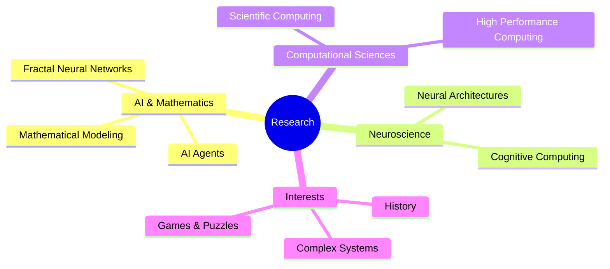
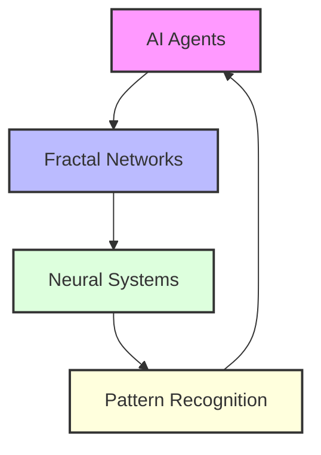
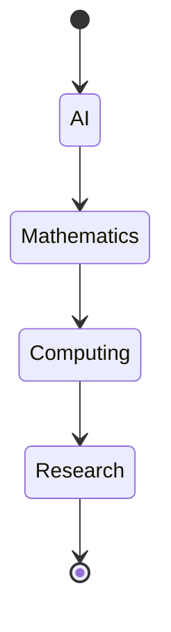
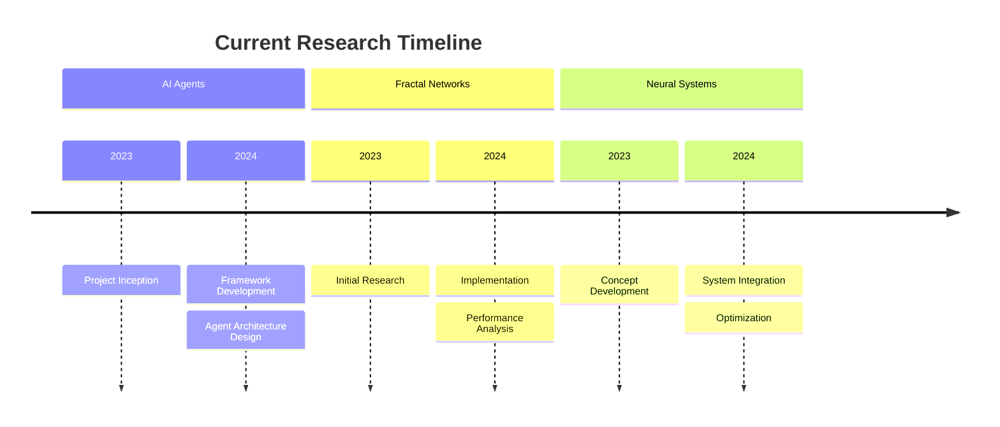
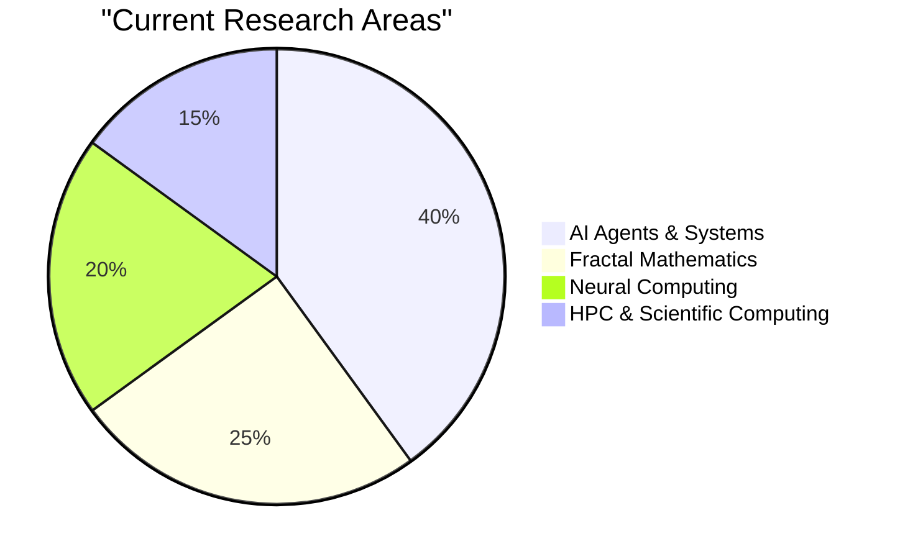
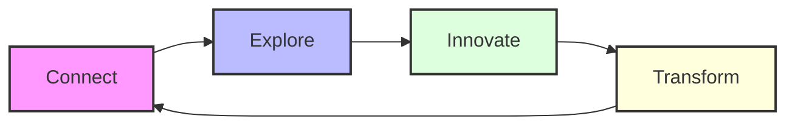

  

  

  
  
  

## 🎭 About Me

<table>
<tr>
<td width="60%">

### 🚀 Journey & Focus
I'm deeply passionate about the intersection of AI, Mathematics, and Neuroscience. Currently focused on developing AI agents and exploring innovative approaches in fractal-based neural networks. My interdisciplinary background allows me to bring unique perspectives to complex problems in these fields.

### 🎯 Research Interests

### 🌟 Current Focus
- 🤖 Developing advanced AI agents
- 🧠 Research in fractal-based neural networks
- 🎮 Exploring computational puzzle solving
- 📚 Studying historical patterns in scientific discoveries

</td>
<td width="40%">

### 🔍 Active Projects

### 🎓 Key Areas

</td>
</tr>
</table>

## 🛠️ Technology Stack

### Primary Tools & Languages
<table>
<tr>
<td>

**AI/ML**
- TensorFlow | PyTorch
- JAX | NumPy
- SciPy | Pandas
- Scikit-learn

</td>
<td>

**Languages**
- Python | Julia
- MATLAB | R
- C++ | Rust
- LaTeX

</td>
<td>

**Tools**
- Git | Docker
- VS Code | Jupyter
- Linux | Cloud
- HPC Systems

</td>
</tr>
</table>

## 📚 Featured Projects

  <table>
    <tr>
      <td width="50%">
        <h3>🤖 AI Agents Platform</h3>
        
Developing an innovative platform for autonomous AI agents with advanced decision-making capabilities and fractal-based learning systems.

      </td>
      <td width="50%">
        <h3>🧠 Fractal Neural Networks</h3>
        
Research project exploring the application of fractal mathematics in neural network architectures for improved pattern recognition.

      </td>
    </tr>
  </table>

## 📊 Research Focus Distribution

## 📈 GitHub Analytics

  <table>
    <tr>
      <td width="50%">
        
      </td>
      <td width="50%">
        
      </td>
    </tr>
  </table>

## 🤝 Let's Connect

  

    Interested in AI agents, fractal mathematics, or computational puzzles? 
    Let's collaborate on pushing the boundaries of artificial intelligence!
  

  

  

  

