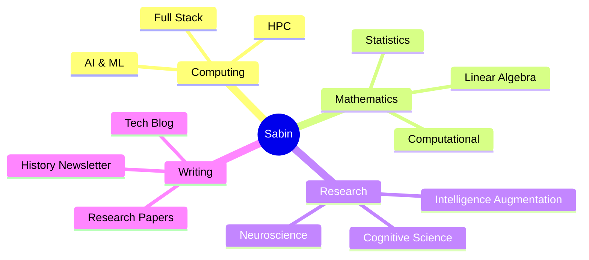
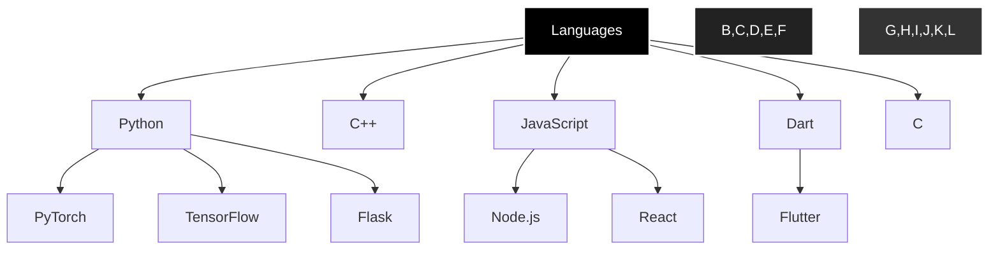

  

<h2 align="center">🧠 About Me</h2>

  

> Exploring the intersections of Mathematics, AI, and Neuroscience. Currently building tools that augment human intelligence and automate cognitive tasks.

- 📚 Second Year Computational Mathematics Student
- 🤖 Working on AI agents and automation tools
- 📝 Writing about history at [Athena's Owl](https://newsletter.munwalker.com)
- 💭 Blogging about tech and thoughts at [munwalker.com](https://munwalker.com)
- 🎯 Interested in MLOps, DevOps, and High Performance Computing
- 🔬 Researching cognitive enhancement through AI
- 🌱 Learning Julia and Rust
- 🤝 Open for collaboration on AI/ML projects

<h2 align="center">🛠️ Tech Stack</h2>

<b>Languages & Frameworks</b>

 

  

<b>Tools & Technologies</b>

 

<h2 align="center">🚀 Featured Projects</h2>

  

<h2 align="center">📊 GitHub Analytics</h2>

  

<h2 align="center">📝 Latest Blog Posts</h2>

<!-- BLOG-POST-LIST:START -->
- 🔮 [The Future of AI-Enhanced Productivity](https://munwalker.com)
- 🧠 [Understanding Neural Networks: A Mathematical Perspective](https://munwalker.com)
- 📚 [Ancient Greece: The Birth of Democracy](https://newsletter.munwalker.com)
<!-- BLOG-POST-LIST:END -->

<h2 align="center">🤝 Connect With Me</h2>

  

  
### 📫 How to reach me: [sabin@munwalker.com](mailto:sabin@munwalker.com)

